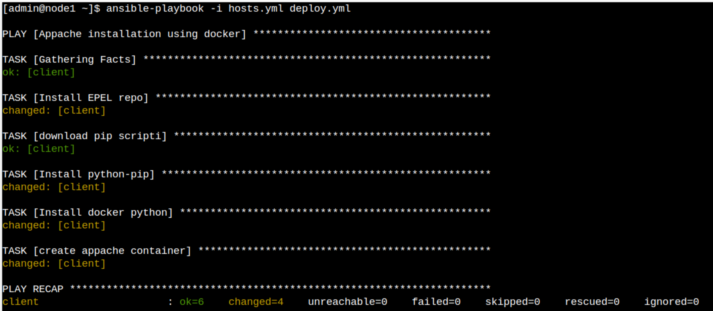

# example-ansible-playbook
We notice that to perform this ansible lab we are using this docker platefrorm [https://docker.labs.eazytraining.fr](https://docker.labs.eazytraining.fr/),  provided by eazytraining.


First, we create a cluster that includes an 'ansible controller' and a 'managed node'. We can create them by selecting the pre-configured instances eazytraining/ansible and eazytraining/client, respectively.

<!---->

<p align="center">

</p>
<p align="center">
Select the preconfigured ansible instance before validating its creation
</p>
 

<!-- -->

<p align=center>

</p>
<p align=center>Select the preconfigured client instance before validating its creation</p>


Note that we use interchangeably managed node and remote machine.

For security reasons, we avoid using the 'root' user for these operations. Instead, we will use the 'admin' user. We can switch to this user by executing the command:
```
sudo su admin -
``` 
We check that we are in the directory _/home/admin_ by executing the command:
```
pwd
``` 
<p align=center>

</p>
<p align=center>Change the user to be admin</p>

This docker plateform allows to create instances that run on CentOS linux distribution 

<p align=center>

</p>
<p align=center>The linux distribution</p>

We create a folder _'webapp'_ that will contain all the files of our ansible project.
Now, we are going to create an inventory file called 'hosts.yml' defining a group of hosts called 'prod' that contains details about our managed node that we are naming _'client'_.

For simplification reasons, it's worth to mention that in what follow, we will disable the strict host key checking during the SSH connection process. This can be achieved by adding the following option in the inventory file 
```
ansible_ssh_common_args: '-o StrictHostKeyChecking=no'
```
Here is the inventory file _'hosts.yaml'_:
```
all:
  vars:
    ansible_ssh_common_args: '-o StrictHostKeyChecking=no'
prod:
  hosts:
    client:
      ansible_host: 10.0.0.4
```
Let's create a folder called _'group_vars'_ that stores variables specific to each group of hosts. 
It is important to note that the file names in the _'group_vars'_ directory must exactly match the names of the host groups defined in our Ansible inventory.

In our case, the _'group_vars'_ directory should contain a file called _'prod.yml'_ that defines connection information to be used by Ansible (login and password).
This is the _'group_vars/pod.yml'_ file :
```
ansible_user: admin
ansible_password: admin
```
Next, we are going to create a playbook called _'deploy.yml'_ to deploy an 'apache' container while considering the  tree-like format for our Ansible project:

```
  - webapp
	|- hosts.yml
	|- deploy.yml
	|- group_vars
	    |-prod.yml
```
To achieve our goal, let's start by defining  a simple playbook _'deploy.yml'_ that contains the basic task in the 'tasks section'. This task allows to create a docker container called _'webapp'_ using the "httpd" image and exposes port 80 on the container to port 80 on the host machine as follows :
```
- name: "Appache installation using docker"
  hosts: prod
  tasks:
    - name: create appache container
      docker_container:
        name: webapp
        image: httpd
        ports:
          - "80:80"
```
We launch our playbook by running the following command:
```
ansible-playbook -i hosts.yml deploy.yml
```
<p align=center>

</p>
<p align=center>Error related to python lib to interacte with Docker</p>

An error is displayed to indicate that Ansible is unable to import the necessary Python library for interacting with Docker, which suggests that either the "docker" or "docker-py" library is missing depending on the Python version being used

We are going to define in our playbook a task that installs this library, but we have to define it in the pre-tasks section.

```
---
- name: "Appache installation using docker"
  hosts: prod
  pre_tasks:
    - name: Install docker python
      pip: name=docker-py
  tasks:
    - name: create appache container
      docker_container:
        name: webapp
        image: httpd
        ports:
          - "80:80"
```

when executing the command to launch the playbook, we get this error : 

<p align=center>

</p>
<p align=center>Error indicates that python-pip is missing</p>

This error message indicates that Ansible is either unable to import the required Python library "setuptools" or the library is already installed but Ansible is using the wrong Python interpreter.
To deal with this error, let's install in the _'pre-tasks section'_ the the _python-pip_ library by using the get-pip.py script. this later will be downloaded from the official Python website: https://bootstrap.pypa.io/pip/2.7/get-pip.py. 
So our playbook becoms as follows :  
```
---
- name: "Appache installation using docker"
  hosts: prod
  pre_tasks:
    – name: download pip script
      get_url:
        url: https://bootstrap.pypa.io/pip/2.7/get-pip.py
        dest: /tmp/get-pip.py
    - name: Install python-pip
      command: python2.7 /tmp/get-pip.py
    - name: Install docker python
      pip: name=docker-py
  tasks:
    - name: create appache container
      docker_container:
        name: webapp
        image: httpd
        ports:
          - "80:80"
```
We get the error below when we execute our playbook

<p align=center>

</p>
<p align=center>Error due to missing of some centOS packages</p>

This error message indicates that Ansible is unable to find pip (the package installer for Python) on the managed node and precise that the task "Install docker python" requires pip to install the Docker SDK for Python.

To resolve this error, we should install the Extra Packages for Enterprise Linux (EPEL) repository on the remote machine. The EPEL repository contains additional software packages that are not included in the default CentOS repositories. We can add a condition to ensure that this task is only executed on CentOS machines.

```
---
- name: "Appache installation using docker"
  hosts: prod
  pre_tasks:
    - name: Install EPEL repo
      package: name=epel-release state=present
      when: ansible_distribution == "CentOS"

    – name: download pip script
      get_url:
        url: https://bootstrap.pypa.io/pip/2.7/get-pip.py
        dest: /tmp/get-pip.py
    
    - name: Install python-pip
      command: python2.7 /tmp/get-pip.py

    - name: Install docker Python
      pip: name=docker-py
  
  tasks:
    - name: create appache container
      docker_container:
        name: webapp
        image: httpd
        ports:
          - "80:80"
```
Running our playbook again generates an error but this time, it indicates that Ansible is not able to install the EPEL repository package on the remote machine because of a permission issue. The task "Install EPEL repo" requires administrative privileges to install packages on the remote machine, but the current user does not have sufficient privileges to perform this action.

<p align=center>

</p>
<p align=center> Need of password for the managed node to install packages </p>

In this case, we should either run the Ansible playbook as the root user or use a user with sudo privileges to run the playbook. We can do this by adding the _'become: true'_ parameter to the task or to the entire playbook, and defining the sudo password that will be used on the managed node, like this:
```
---
- name: "Appache installation using docker"
  hosts: prod
  become: true
  vars:
    ansible_sudo_pass: admin
  pre_tasks:
    - name: Install EPEL repo
      package: name=epel-release state=present
      when: ansible_distribution == "CentOS"

    – name: download pip script
      get_url:
        url: https://bootstrap.pypa.io/pip/2.7/get-pip.py
        dest: /tmp/get-pip.py
    
    - name: Install python-pip
      command: python2.7 /tmp/get-pip.py

    - name: Install docker Python
      pip: name=docker-py
  
  tasks:
    - name: create appache container
      docker_container:
        name: webapp
        image: httpd
        ports:
          - "80:80"
```
After this last modification, we launch the playbook to see that all tasks are well executed as illustrated in the figure below: 

<p align=center>

</p>
<p align=center> All tasks are executed correctely</p>
And this is the httpd running on the web browser: 
<p align=center>

</p>
<p align=center> The apache is running on a docker container</p>


To enhance our playbook, we can externalize the password by saving it in the ansible.cfg file.

we create the section _privilege_escalation_ and within it we set the _besome_ask_pass_ to true. this way, Ansible will prompt the user for the become password when needed during playbook execution. This can be useful if the user account running Ansible does not have passwordless sudo access and requires a password to escalate privileges.